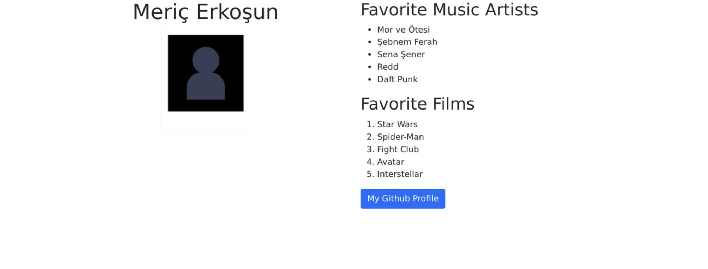

# Improve your Bio page with Bootstrap

## Introduction
In this graded assessment, you will revise your biographical page to use Bootstrap.

## Goal
Use Bootstrap to build your biographical page.

## Objectives
* Add a Bootstrap Grid to the page.

* Set up the grid so that the content will layout correctly on both mobile and desktop.

* Configure your photo to be responsive.

* Change the Github profile link to use a Bootstrap button style.