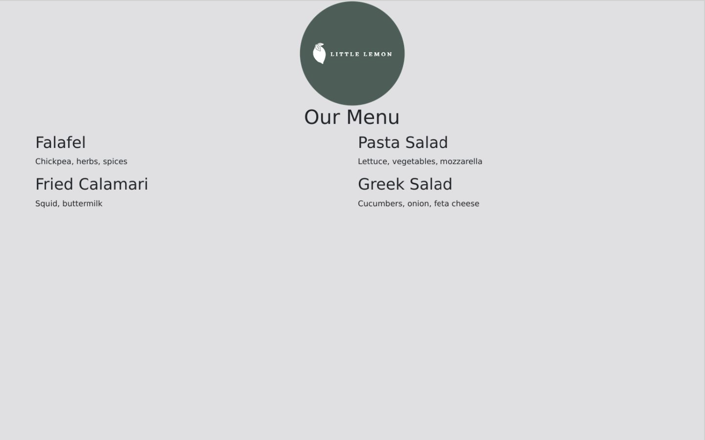

# Lab Instructions: Working with Bootstrap grid

## Introduction
In this exercise, you will practice building a webpage using the Bootstrap Grid.

## Goal
Create a two-column food menu for Little Lemon.

## Objectives
* Set up the Bootstrap container.

* Display the Little Lemon logo in the top center of the webpage using Bootstrap.

* Display the food menu in two columns using Bootstrap Grid.